## Prerequisites: Create a Project in Google Cloud Console & Setup OAuth Consent Screen

### Project and API Configuration

- Go to the [Google Cloud Console](https://console.cloud.google.com/) and create a project.
- Search for **Project** in the top search bar, then click **Create Project**.  
  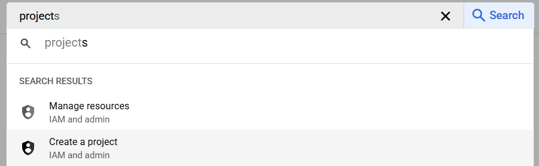
- Enter the project name (e.g., _Gemini-Clone_) and click **Create**.  
  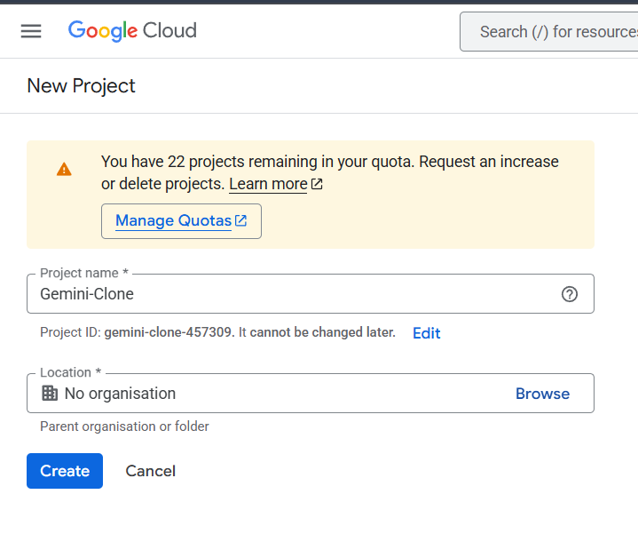

### Setup OAuth Consent Screen

- In the Cloud Console, select your project and navigate to **APIs & Services → OAuth consent screen**.
- Click **Get Started**.  
  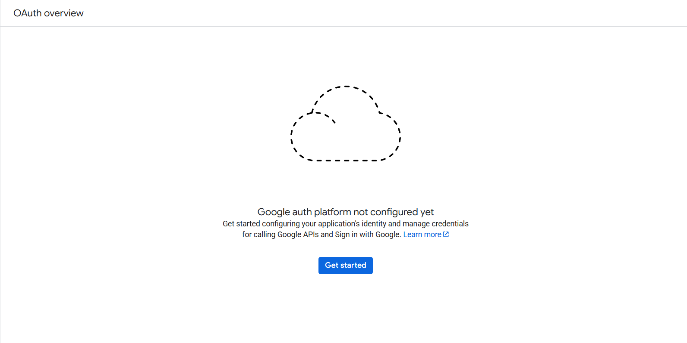
- Fill in all details:
  1. **App information:** Enter app name, support email, etc., then click **Next**.  
     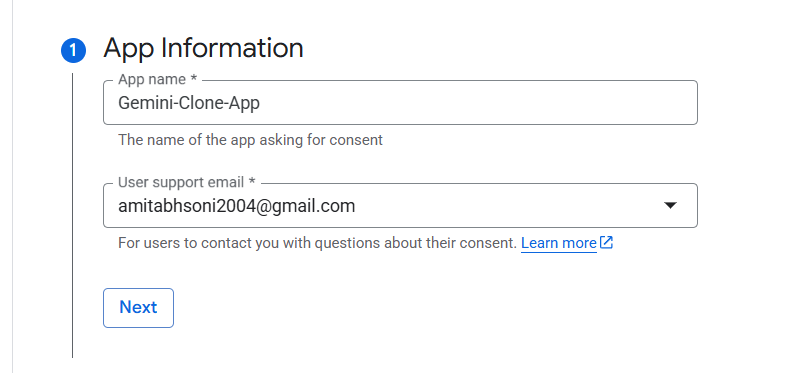
  2. **User type:** Select **External**, then click **Next**.  
     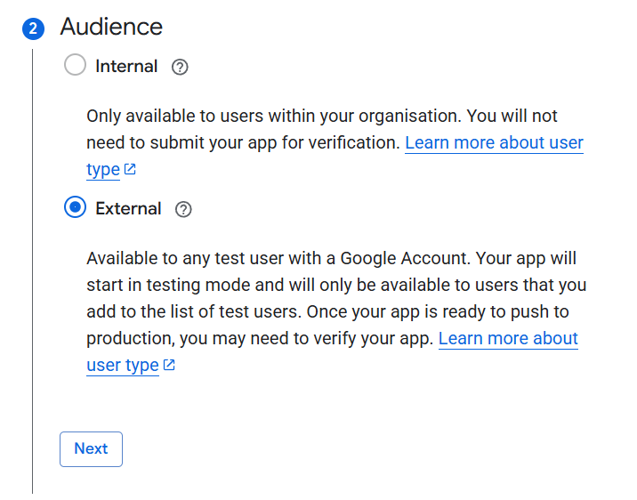
  3. **Contact information:** Enter your email, then click **Next**.  
     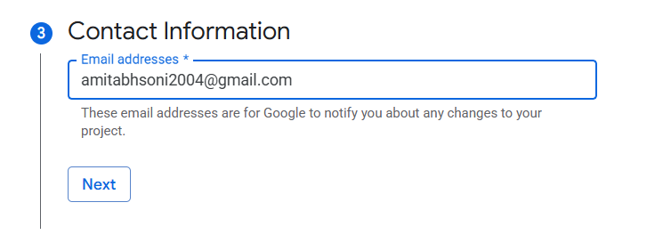
  4. **Scopes & terms:** Agree to the terms, then click **Continue**.  
     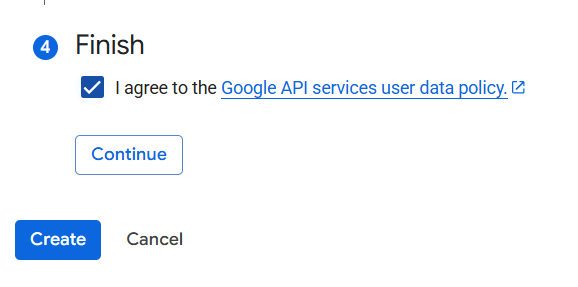
- Click **Create** to finish.
- Ensure this project remains selected whenever you work in the console (use the project selector at top right).  
  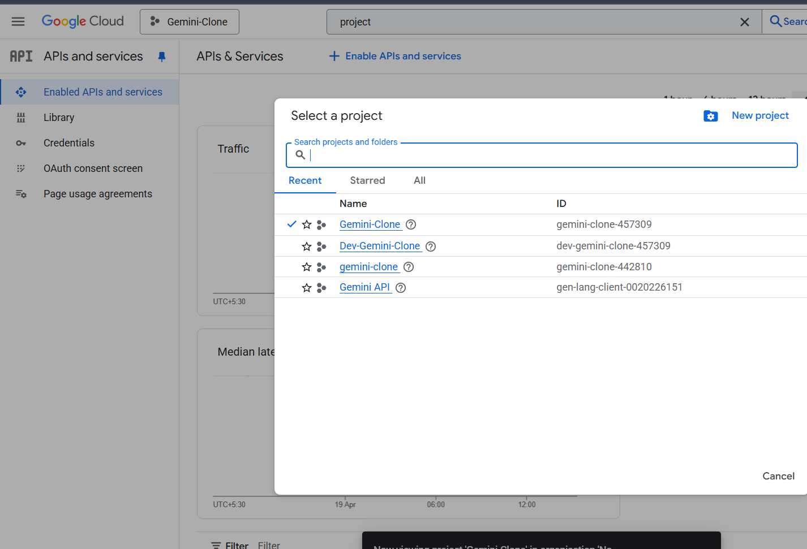

---

## 1. Google OAuth Credentials (GOOGLE_ID & GOOGLE_SECRET)

**Purpose:**  
These credentials authenticate your users via Google’s OAuth 2.0 service.

**Production Setup Steps:**

- In the Cloud Console, select your project and navigate to **APIs & Services → Credentials**.  
- Click **Create Credentials → OAuth client ID**.  
- Choose **Web application**, enter a name, and configure:
  - **Authorized JavaScript origins**  
    ```
    http://your-production-domain.com
    https://your-production-domain.com
    ```
  - **Authorized redirect URIs**  
    ```
    http://your-production-domain.com/api/auth/callback/google
    https://your-production-domain.com/api/auth/callback/google
    ```  
  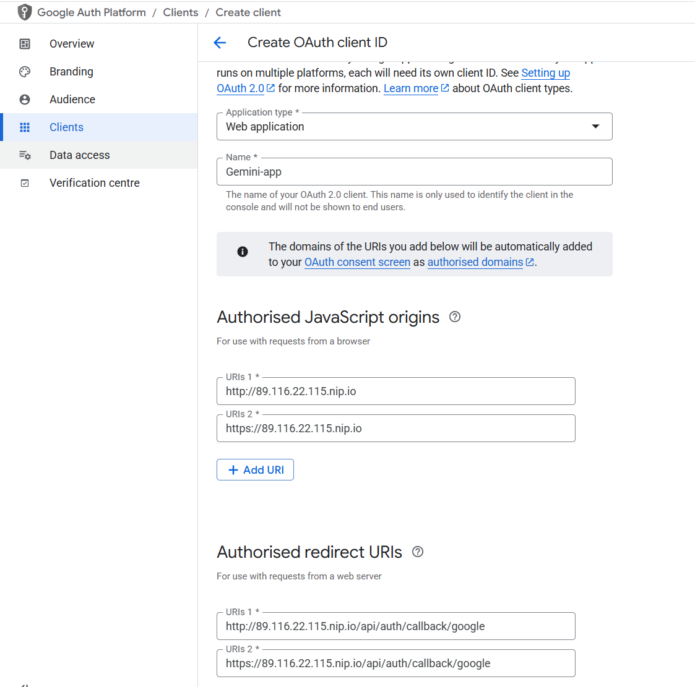
- Click **Create**.  
  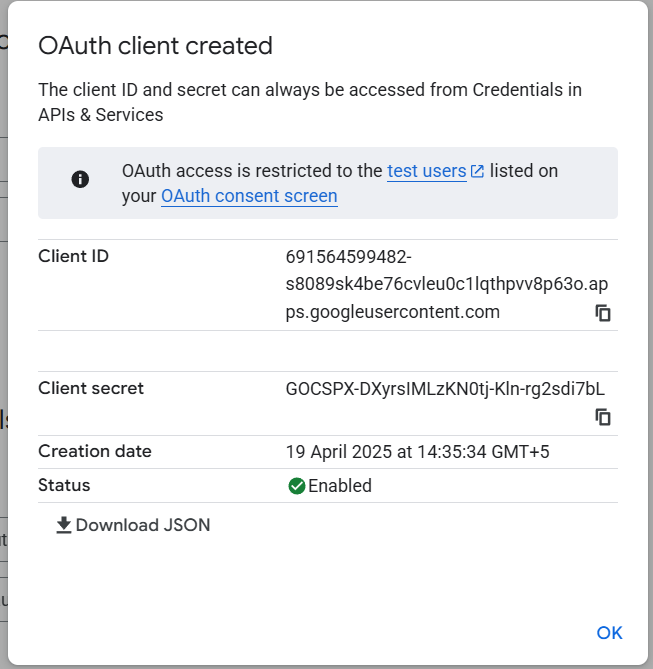
- Copy the **Client ID** and **Client Secret**, then in your `.env.local` (created from `.env.sample`) add:  
  ```bash
  GOOGLE_ID=<your-client-id>
  GOOGLE_SECRET=<your-client-secret>
  ```
- Click **OK** to finish.

---

## 2. Google API Key (NEXT_PUBLIC_API_KEY)

**Purpose:**  
This key authenticates client‑side requests to various Google APIs (Maps, Places, and in this case, the Generative Language API).

**Production Setup:**

- In the Cloud Console, select your project and navigate to **APIs & Services → Credentials**.  
- Click **Create Credentials → API key**.  
  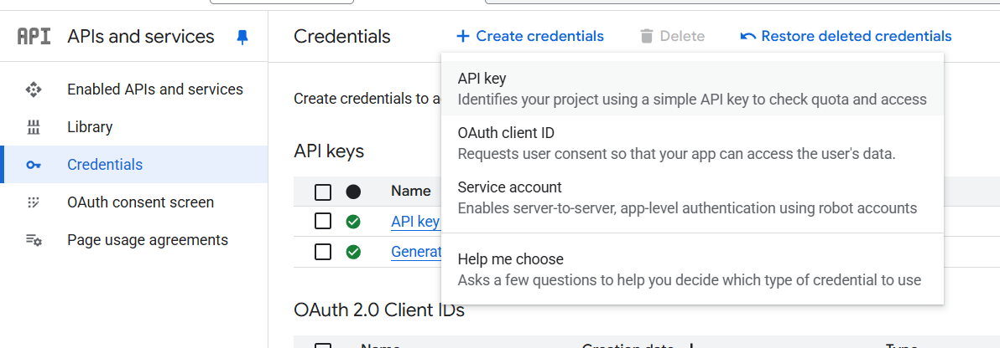  
  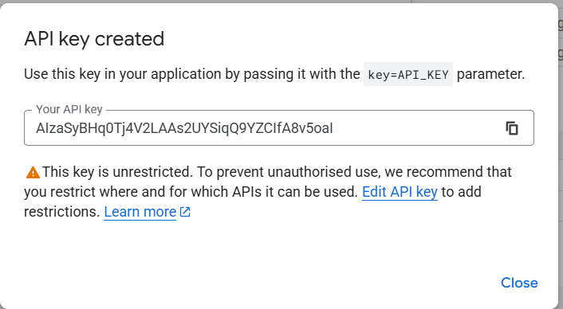

- **Restrict the API key:**
  1. Click on the newly created key.
  2. Under **API restrictions**, select **Restrict key**.
  3. Choose **Generative Language API** and click **Save**.  
     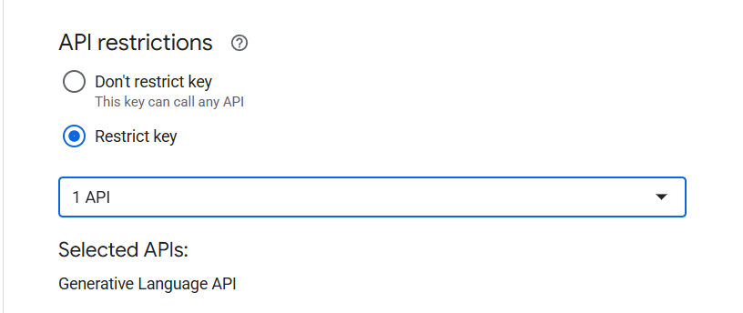
  4. Copy the key and paste it into `NEXT_PUBLIC_API_KEY` in your `.env.local`.

> **Alternative generation:**  
> Visit [https://aistudio.google.com/u/0/apikey](https://aistudio.google.com/u/0/apikey), log in, click **Create API key**, choose your project. It will auto‑restrict to the Generative Language API.  
> 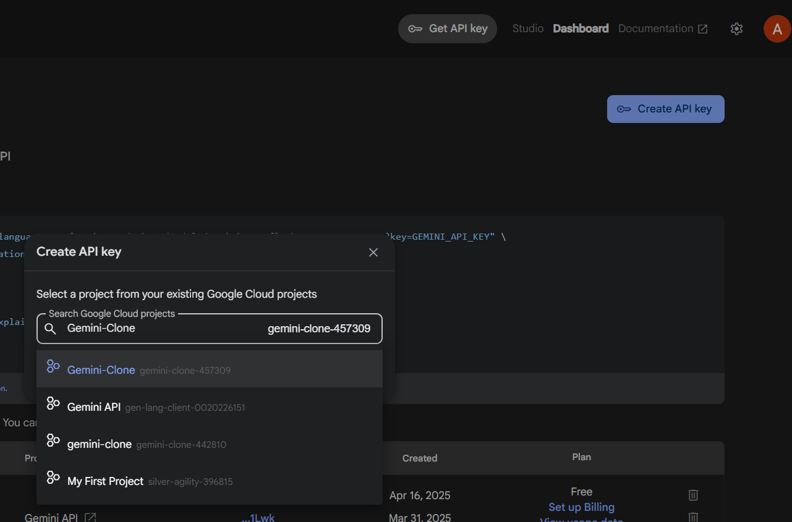  
> 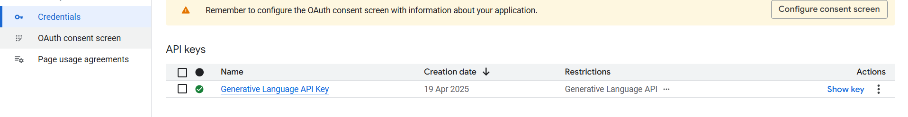  
> Copy it into `NEXT_PUBLIC_API_KEY` in your `.env.local`.

---

## 3. NextAuth Secret (NEXTAUTH_SECRET)

**Purpose:**  
This secret secures sessions and token encryption for NextAuth.

**Production Setup:**

> **Note:** Node.js must be installed on your system (download from [nodejs.org](https://nodejs.org/en/download)).

1. In your project root (`dev-gemini-clone`), run:  
   ```bash
   npx auth secret
   ```
   This generates a secure random string and creates `.env.local` if it doesn’t exist.
2. Copy the generated value and set in your `.env.local`:  
   ```bash
   NEXTAUTH_SECRET=<generated-secret>
   ```
3. Ensure the key name is **NEXTAUTH_SECRET**.

---

## 4. Base URL for the Application (NEXTAUTH_URL)

**Purpose:**  
This URL specifies your application’s canonical domain for constructing callback URLs and other endpoints in NextAuth.

**Production Setup:**

- Replace your development URL with your production domain. For example:  
  ```
  NEXTAUTH_URL=https://your-production-domain.com
  ```
- Ensure this value matches exactly the authorized domains in your OAuth credentials.

---

## 5. MongoDB Connection String (MONGODB_URI)

**Purpose:**  
The connection string directs your application to your MongoDB database hosted on Atlas.

**Production Setup Using MongoDB Atlas:**

- Sign in to [MongoDB Atlas](https://www.mongodb.com/cloud/atlas) and create a cluster.  
  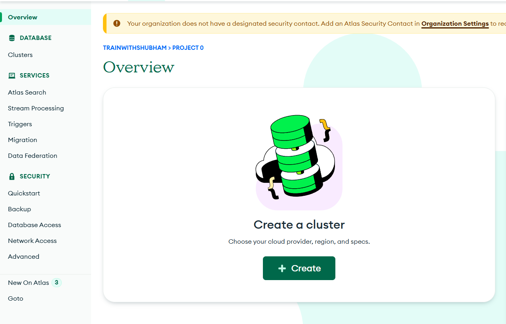
- Select **Connect → Connect your application**, then click **Show connection string**.  
  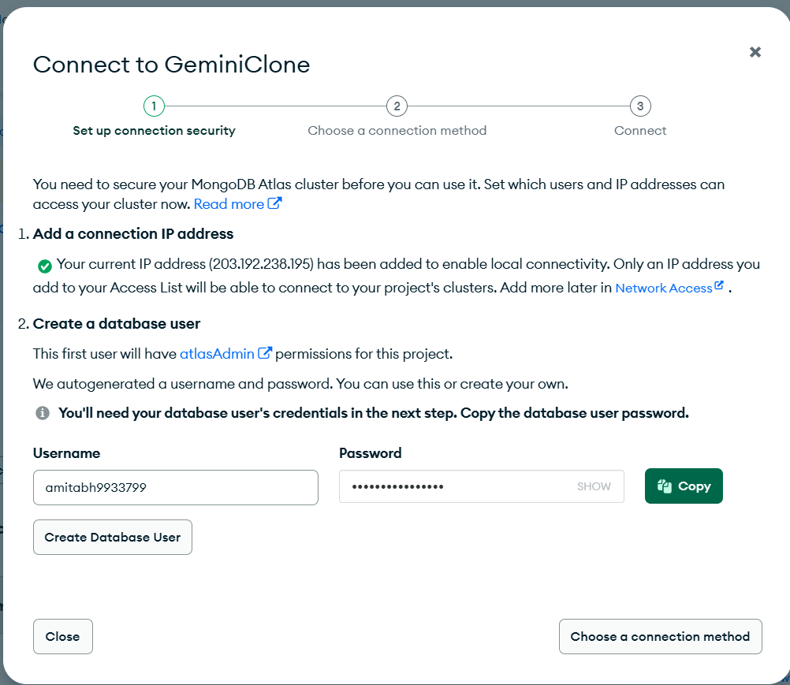
- Copy the connection string (including username and password), then paste it into `MONGODB_URI` in your `.env.local`.
- Click **Done**.

> **Optional via Compass:**  
> If prompted, choose Compass as your connection method:  
> 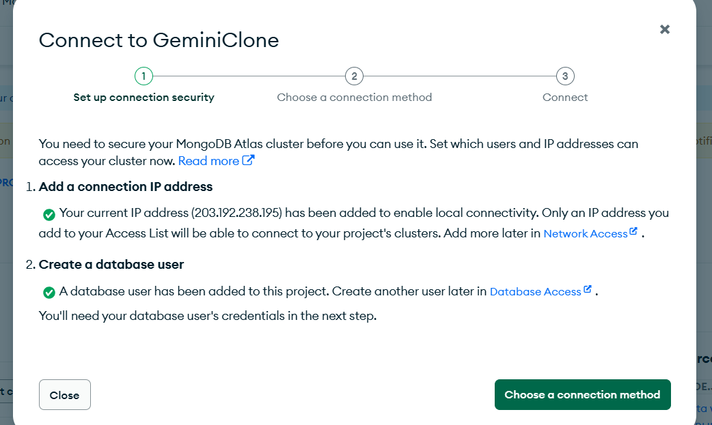  
> Select your OS, download/launch Compass, then **Show password** and copy the connection string:  
> 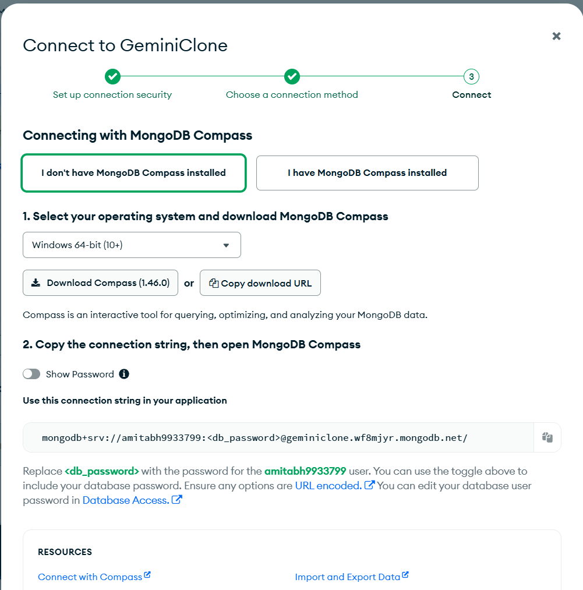  
> Paste into `MONGODB_URI` in your `.env.local`.

> **Note:** Store your Atlas credentials securely for future use.

---

## General Best Practices for Production Environments

- **Environment Variable Management:**  
  Use environment‑specific files (e.g., `.env.production`) excluded from version control, or leverage a secrets manager (Google Secret Manager, AWS Secrets Manager, HashiCorp Vault).
- **Secure Network and Access:**  
  Restrict access via IP whitelisting, VPNs, or VPCs; enforce HTTPS.
- **Regular Auditing and Rotation:**  
  Monitor, audit, and rotate credentials (API keys, secrets) per your security policies; set up alerts for unusual activity.
- **Logging and Monitoring:**  
  Implement comprehensive logging/monitoring for both your application and its interactions with external APIs; integrate with cloud‑provider or third‑party tools to detect and respond to incidents.
